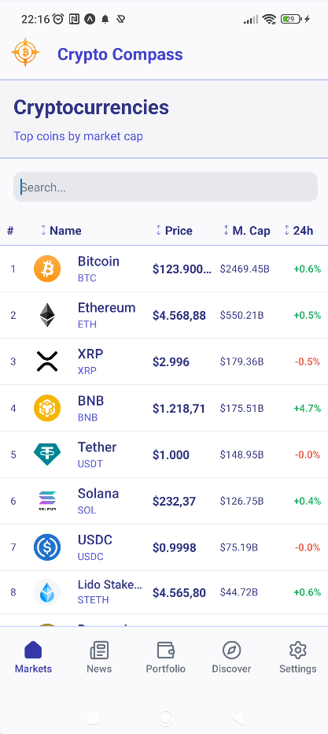
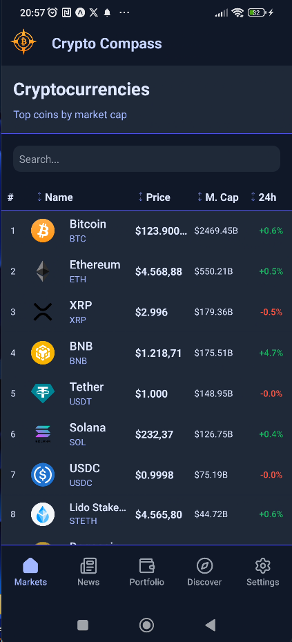
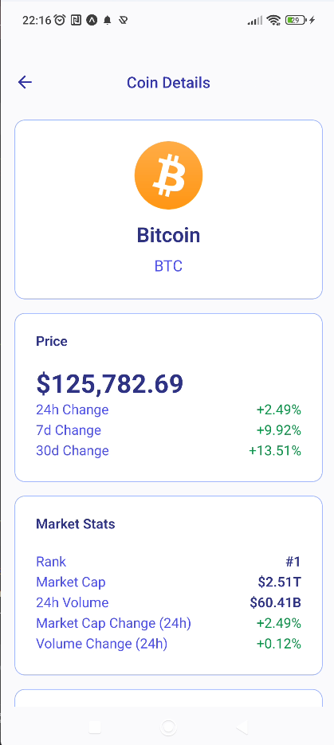
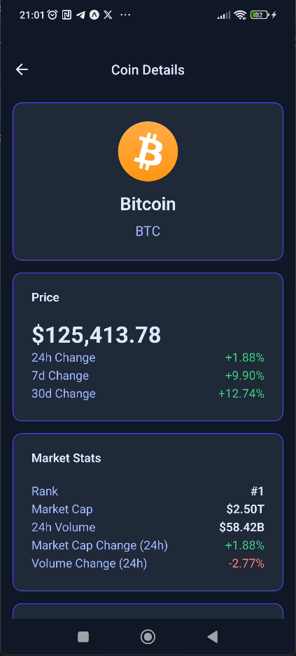
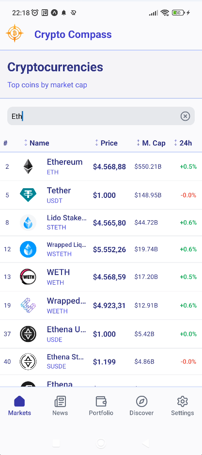
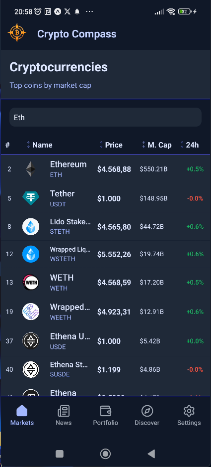
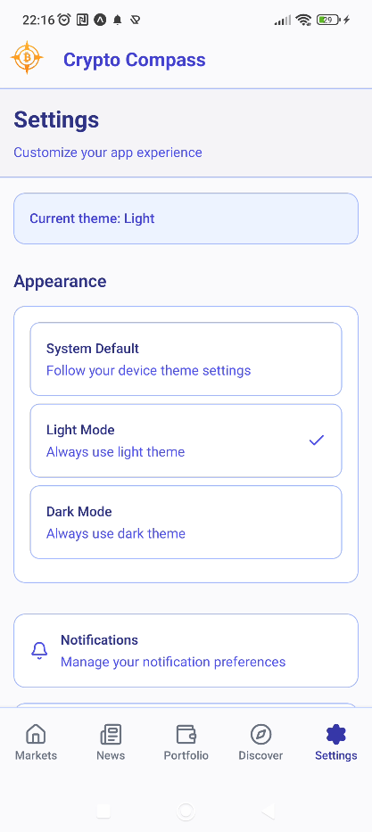
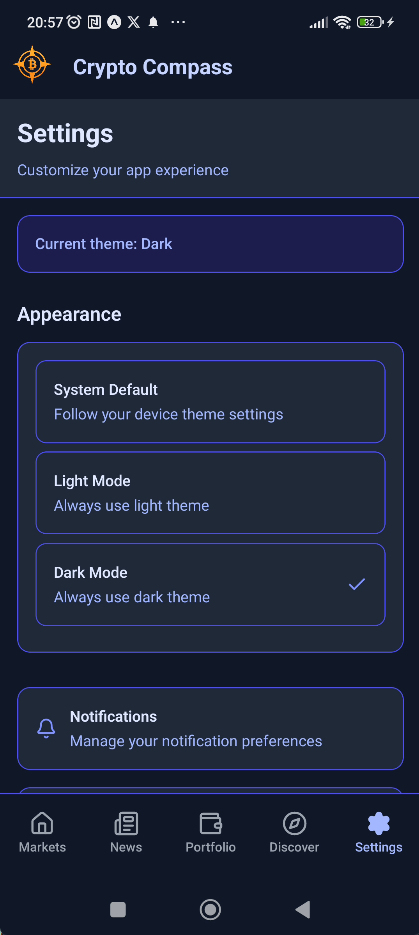
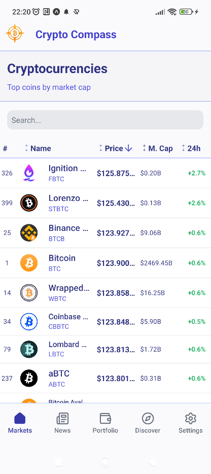
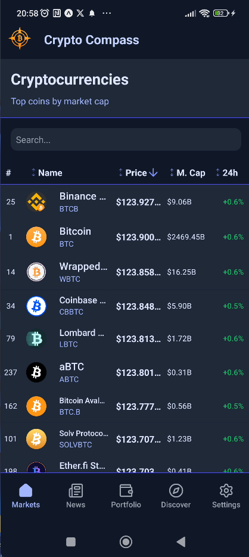

<div align="center">
  
</div>

# Crypto-Compass Mobile App

A sleek and intuitive React Native application for tracking cryptocurrency prices, market trends, and managing your digital asset portfolio. This project was developed as part of the hiring process to showcase modern mobile development practices.

## ✨ Features

- **Real-time Crypto Tracking**: View up-to-date prices and market data.
- **Coin Discovery**: Browse cryptocurrencies with pull-to-refresh and infinite scroll for seamless pagination.
- **Search & Filtering**: Easily find specific cryptocurrencies.
- **Detailed Coin View**: Access in-depth information for each coin, including market stats, price history, and supply data.
- **Dark/Light Mode Toggle**: Switch between themes for comfortable viewing.
- **Smooth Animations**: Enjoy fluid animations and transitions throughout the app.
- **Comprehensive Tests**: Unit and component tests written with Jest and React Native Testing Library.
- **Portfolio Management**: (Coming Soon) Track the value of your personal crypto holdings.
- **News Feed**: (Coming Soon) Stay informed with the latest news from the crypto world.

## 🖼️ Screenshots

|                                  Light Mode                                  |                                  Dark Mode                                  |
| :--------------------------------------------------------------------------: | :-------------------------------------------------------------------------: |
|                                _Main Screen_                                 |                                _Main Screen_                                |
|          |          |
|                                _Coin Details_                                |                               _Coin Details_                                |
|  |  |
|                                   _Search_                                   |                                  _Search_                                   |
|        |        |
|                                  _Settings_                                  |                                 _Settings_                                  |
|      |      |
|                                  _Sorting_                                   |                                  _Sorting_                                  |
|       |       |

## 🛠️ Tech Stack

- **Core**: React Native, Expo
- **Language**: TypeScript
- **Styling**: Tailwind CSS (via NativeWind)
- **State Management**: Zustand
- **Navigation**: Expo Router (file-based)
- **Testing**: Jest & React Native Testing Library

## ✅ Prerequisites

Before you begin, ensure you have the following installed:

- [Node.js](https://nodejs.org/) (LTS version recommended)
- `npm` or `yarn`
- [Watchman](https://facebook.github.io/watchman/) (for macOS/Linux users)
- **For Android**: [Android Studio](https://developer.android.com/studio) with a configured Android Emulator (e.g., Pixel 6).
- **For iOS**: [Xcode](https://developer.apple.com/xcode/) (latest version) with configured iOS Simulator (e.g., iPhone 15).

## 🚀 Installation & Setup

Follow these steps to get the development environment running.

1.  **Clone the repository:**

    ```bash
    git clone https://github.com/giannis198/crypto-compass-app-v.1.git
    cd crypto-compass-app-v.1
    ```

2.  **Install dependencies:**
    Choose your preferred package manager.

    ```bash
    # Using npm
    npm install

    # Using yarn
    yarn install
    ```

3.  **Install iOS Pods:**
    For iOS, you need to install the CocoaPods dependencies.

    ```bash
    # Navigate to the ios directory, install pods, and return to the root
    npx pod-install
    ```

    _or manually:_

    ```bash
    cd ios && pod install && cd ..
    ```

## 🏃 Running the Application

### With Expo Go (Quickest Method)

Expo Go allows you to run the app on a physical device without needing to build the native code.

1.  **Start the Metro Bundler:**

    ```bash
    # Using npm
    npm start

    # Using yarn
    yarn start
    ```

2.  **Scan the QR Code:**
    - Install the "Expo Go" app on your iOS or Android device.
    - Scan the QR code shown in the terminal with your device's camera.

**Note:** This method is best for quick iteration on JavaScript/TypeScript code. If the project contains custom native modules, some features may not work, and you should use the "On Android" or "On iOS" methods instead.

### On Android

1.  **Start an Android Emulator:**
    Open Android Studio, go to the "Virtual Device Manager," and start an emulator (e.g., Pixel 6).

2.  **Run the app:**

    ```bash
    # Using npm
    npm run android

    # Using yarn
    yarn android
    ```

    This will build the app and install it on the running emulator.

### On iOS

1.  **Start an iOS Simulator:**
    You can start a simulator via Xcode or the command line.

    ```bash
    # To open the default simulator
    open -a Simulator
    ```

2.  **Run the app:**
    The command will automatically select a running simulator. To target a specific one, use the `--device` flag.

    ```bash
    # Using npm (on default simulator)
    npm run ios

    # Using yarn (targeting an iPhone 15)
    yarn ios --device "iPhone 15"
    ```

### On a Physical Device

You can also run the app on a physical device using the same `run:android` or `run:ios` commands after connecting your device and trusting the computer.

## 🧪 Running Tests

This project uses Jest for unit and component testing. To run the test suite:

```bash
# Using npm
npm test

# Using yarn
yarn test
```

## 📂 Project Structure

The project follows a feature-based structure to keep the codebase organized and scalable.

```
/
├── app/                # Expo Router file-based routes
├── assets/             # Static assets (images, fonts)
├── components/         # Shared UI components
├── constants/          # Global constants (e.g., theme colors)
├── hooks/              # Custom React hooks
├── lib/                # Utility functions and libraries
├── provider/           # React Context providers
├── store/              # Zustand state management stores
└── types/              # TypeScript type definitions
```

## 🔮 Future Enhancements

Given more time, here are some improvements that could be implemented:

- **Performance Optimizations**: Further optimize flatlists and component rendering to ensure the smoothest experience on all devices.
- **Enhanced UI/UX Polish**: Add more micro-interactions, custom animations, and refine the design for an even more premium feel.
- **Real-time Updates**: Implement WebSockets to provide real-time price updates without needing to pull-to-refresh.

## 📞 Contact

If you have any questions or run into issues, please feel free to reach out.

- **Name**: Yiannis
- **Email**: <john_nik@windowslive.com>
- **LinkedIn**: www.linkedin.com/in/ioannis-nikitopoulos-547a99122

---

Thank you for reviewing this project!